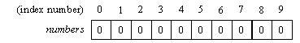

title: Arrays and ArrayLists
tags: lists, arrays

Objectives
- Understand how to declare, create, and initialize arrays and ArrayLists.
- Distinguish between the two.
- Add objects to arrays
- Add objects to ArrayList
- Retrieve values from both structures

Resources
- [Array](https://docs.oracle.com/javase/tutorial/java/nutsandbolts/arrays.html)
- [Index Out of Bounds - Exception](https://docs.oracle.com/javase/7/docs/api/java/lang/ArrayIndexOutOfBoundsException.html)
- [Off-by-one Error](https://en.wikipedia.org/wiki/Off-by-one_error)


## Arrays

An array is an object that stores a fixed number of elements (of the same type) in an order accessible by index or position starting from index 0 to the last index.

Distinguishing features of an array

1)Data is stored in consecutive memory locations (in RAM).
2) After creation, its length is fixed.

Before we learn how to create array objects, here is a code snippet featuring an array that should look somewhat familiar:

```java
public static void main(String[] args){
    for(int i = 0; i < args.length; i++){
      System.out.println("Arg " + i + ":" + args[i]);
    }
}
```

*Declaring An Array*
Declaring an array means creating a reference to that array. Here's how go declare an array of int's called numbers.

```
int[] numbers;
```

So far, the reference to the array has been created, but the array itself is not yet created. In order to store and access elements, we must initialize the array.

*initializing Array*

Java provides two ways to initialize arrays.

1) We can specify a length of the array using the following syntax:


```java
int[] numbers = new int[10]
```
The above code initializes numbers to an array with a length of 10.
Note the key word new, which is used to create a new instance of object.

Here is a visual interpretation of the array:



Note: the numbering of elements starts from 0
All arrays in Java start with the zero index! Also, the default value of every element in an array of integers is 0 prior to setting the values of each element.
[array-zeroes](array-of-zeroes.jpg)

Note: the numbering of elements starts from 0 All arrays in Java start with the zero index! Also, the default value of every element in an array of integers is 0 prior to setting the values of each element.


2) We can also directly initialize an array with desired elements by using the follow syntax:

```java
int[] numbers = { 1, 2, 3, 4, 5};
String[] names = {"Alice", "Bob", "Edsger", "Grace"};
```
Both ways will create an array of fixed-size and with the same element type. The only difference is that the latter initialization approach defaults to selected values.

Note that we can create arrays of any type. Above, we also have an array of Strings.


 *Accessing Arrays*
Once your array has been declared and initialized, you can access any element by referencing the name of the array and the desired index. The only constraints are that the index number must be greater than or equal to zero (first index) and less than or equal to the array's length - 1 (last index).


```java
int[] numbers = new int[10];
```

 *Accessing Arrays*
Once your array has been declared and initialized, you can access any element by referencing the name of the array and the desired index. The only constraints are that the index number must be greater than or equal to zero (first index) and less than or equal to the array's length - 1 (last index).

An array's .length property returns the number of elements in the array.

```java
int firstNumberinArray = numbers[0];
```   

We can also update any element in the array by assigning a new value to it.

```java
numbers[4] = 100;
```


An array's `length` property returns the number of elements in the array.
Consider the following code snippet:

```java
int[] numbers = new int[10];
System.out.println(numbers.length); // 10
```

Be mindful of Off-by-one errors when using the array's length property. Remember that Java's indices begin at 0, but the length refers to the numbers of elements within the array, NOT the value of the last index.

In our numbers, array, trying to access the element at the 10th index would yield an ArrayIndexOutOfBoundsException because the array's 10 elements are only within the range from 0 - 9 ( 0 to the array's length - 1).

```java
int[] numbers = new int[10];
System.out.println(numbers[10]); // Throws ArrayIndexOutOfBoundsException: 10
```


Important to remember
- Arrays must have elements of the same type
- fixed length. Calling array.length will return the number of elements the array contains.
- index vs. value;

## Exercise:
 1) Create an array of Movie objects, which will store your top favorite movies. You will need to create a Java class for the movie object, which at a minimum should have a String variable as its title field.

 2) Print the names of the items in your favoriteMovies array in reverse.


## ArrayLists

 A collection is a group of objects. Today, we'll be looking at a very useful collection, the ArrayList. A list is an ordered collection, and an ArrayList is one type of list.


A *collection* is a group of objects. We'll be looking at a very useful collection, the `ArrayList`. A *list* is an ordered collection, and an `ArrayList` is one type of list.

Create a class `MovieListings` and follow along in it.


Before we can use an `ArrayList`, we have to `import` it:

```java
import java.util.ArrayList;
```

Before looking at the constructor for an arraylist, here are some distinguishing features of an  arraylist:

1) Arraylists do NOT have a fixed size. The size() method returns the number of elements the list contains.
2) May contain elements of the same type OR elements of different types.
3) Common operations : add(), get(), remove(), size();

Next, we call the constructor, but we have to declare the type of object the `ArrayList` is going to hold. This is how you create a new `ArrayList` holding `String` objects.

```java
ArrayList<String> names = new ArrayList<String>();
```

Notice the word "`String`" in angle brackets: "<String>". This is the Java syntax for constructing an `ArrayList` of `String` objects.

We can add a new `String` to `names` using the `add()` method.

```java
names.add("Ana");
```

> **Exercise:** Write a program that asks the user for some names and then stores them in an `ArrayList`. Here is an example program:
> ```
> Please give me some names:
> Sam
> Alecia
> Trey
> Enrique
> Dave
> Your name(s) are saved!
> ```

We can see how many objects are in our `ArrayList` using the `size()` method.

```java
System.out.println(names.size()); // 5
```

> **Exercise:** Modify your program to notify the user how many words they have added.
> ```
> Please give me some names:
> Mary
> Judah
> Your 2 name(s) are saved!
> ```

Remember how the `String.charAt()` method returns the `char` at a particular index? We can do the same with `names`. Just call `get()`:

```java
names.add("Noah");
names.add("Jeremiah");
names.add("Ezekiel");
System.out.println(names.get(2)); // "Ezekiel"
```

> **Exercise:** Update your program to repeat the names back to the user in reverse order. Your solution should use a for loop and the `size()` method. For example:
> ```
> Please give me some names:
> Ying
> Jordan
>
> Your 2 name(s) are saved! They are:
> Jordan
> Ying
> ```

Finally, we can ask our `names` `ArrayList` whether or not it has a particular string.

```java
names.add("Veer");
System.out.println(names.contains("Veer")); // true
```

> *Exercise:* Update your program to check if a name was input by the user. For example:
> ```
> Please give me some names:
> Ying
> Jordan
>
> Search for a name:
> Ying
> Yes!
> ```

An `ArrayList` can hold any type of object! For example, here is a constructor for an `ArrayList` holding our `Movie` class from last week.

```java
ArrayList<Movie> people = new ArrayList<Movie>();
```

> **Exercise:** Modify your program to prompt the user for their favorite movies and store each one  as a `Movie` instance. Rather than storing `String` objects in the `ArrayList`, store `Movie` objects by constructing them with the input name. You'll need to use the `Movie` constructor to get a `Movie` instance!

# In-class assignment

Write a class `BlueBook` that tells the user the price of their car, depending on the make, model, and year. You should use [`Car.java`](https://github.com/accesscode-2-1/unit-0/blob/master/in-class%20exercise%20solutions/BlueBook/Car.java) and the stencil file provided, [`BlueBook.java`](https://github.com/accesscode-2-1/unit-0/blob/master/in-class%20exercise%20solutions/BlueBook/BlueBook.java).

Your program depends on what cars your `BlueBook` supports, but here is an example program:

```
What is your car's make?
Toyota
What is your Toyota's model?
Corolla
What is your Toyota Corolla's year?
1999

Your 1999 Toyota Corolla is worth $2000.
```


[Exit Ticket](https://docs.google.com/a/c4q.nyc/forms/d/1qFInKs9bdHUidM0mWyr-CuMFy9bYzBiOit9JQ4HgCAM/edit)
