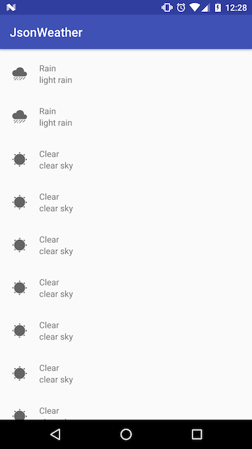

## JsonWeather
#### Exercises in writing POJOs that represent json data

Slides: https://goo.gl/a3kUdQ [PDF](10%2F15%2F16 - JSON and RecyclerView.pdf)

## Instructions:

Clone the repo:

```git clone https://github.com/ekchang/JsonWeather.git```

Navigate to `JsonWeather/app/src/main/assets`. There are four json files there.

 - `coord` (SIMPLE)
 - `city` (NORMAL)
 - `forecast` (MEDIUM)
 - `five_day_forecast` (WTF)
 
Write the necessary POJOs required to represent each json file. You are encouraged to tackle them in this order.
 
Validate your answers inside `MainWeatherExercise` by running:

```JsonValidator.validate(MyClass.class, SIMPLE);``` 

for each json file.

#### RecyclerView exercise

Make sure your git status is clean. Switch to `git checkout rv_exercise`. Your task is to build a RecyclerView that can display a List of Weather objects.

- Take a look at `assets/five_day_forecast.json` and inspect the kind of data you get from Weather objects
- Create a layout that can display a weather icon, the title, and description of the weather forecast.



#### Vocabulary

- **JSON** - Javascript Object Notation
- **POJO** - Plain Old Java Object
- **serialize/deserialize** - the process of converting into a series of bytes for the purpose of data transfer. We serialize POJOs to JSON, and deserialize JSON to Java.
- **RecyclerView** - a lower level replacement for ListView, requiring more set up but has better tooling than ListView. The name comes from its extensive, View recycling logic for optimized performance by re-using Views rather than re-inflating from XML repeatedly (which is expensive).
- **LayoutManager** - The class that RecyclerView delegates to in order to determine how to lay out the child views. There are several built in LayoutManagers including GridLayoutManager, LinearLayoutManager, etc.
- **Adapter** - A type of object that serves as a bridge between your POJOs and Views. 
- **ViewHolder** - An object that caches View instances so you don't need to find them repeatedly through `findViewById` calls