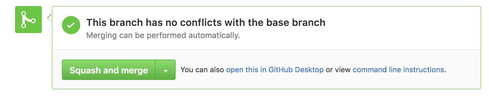
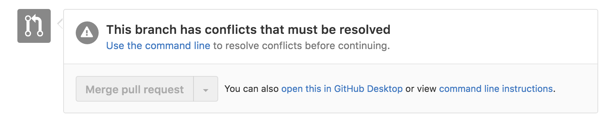

# 🔥 Merge Conflicts 🔥
 

 

## What is merging?

By now, **branches** are a big part of your team collaboration process. When you want to add a new feature or fix a bug, you create a new branch to work in. This gives you a dedicated "copy" of the project to work with and ensures that unstable or in-progress code changes will be kept isolated from the project's `master` branch.

- In class, we've learned how to create a new branch: `git checkout -b <BRANCH NAME GOES HERE>`. 
- `git checkout` can also be used, without the `-b` flag, to check out an existing branch: e.g. `git checkout master`. 
- `git branch` will list all of the branches in your repository.
- `git branch -m <NEW NAME GOES HERE>` will rename the current branch.
- `git branch -d <BRANCH NAME GOES HERE>` will delete a specified branch.

Once you’ve completed a feature or bug fix, it's time to **merge** those changes into the project's main branch (in our case, `master`).

So far, we've learned a process of merging that goes something like this:

1. Finish and test your feature.
2. Run `git add .` to add your changes to the index.
3. Run `git commit -m "Commit message"` to commit your changes to your local branch.
4. Run `git push origin <BRANCH NAME GOES HERE>` to push your branch to GitHub.
5. On GitHub, open a new pull request and assign your teammates to review.
6. When the review is complete, click the green 'Merge' button and GitHub will automatically merge your branch into `master`.

 
###### Merging on GitHub - no conflicts

 

###### Merging on GitHub - merge conflict

 
## What is a merge conflict?

Sometimes, the merge process is too complicated for git to handle automatically. If **the same part of the same file has different changes** in the two branches you’re merging together, git can't decide which change to keep and which change to discard. Instead, git requires you, the programmer, to review the conflicting changes and decide which of them is appropriate to merge.

There's some good news: in git, conflicts can only occur in a developer's local copy of the repository and not on the server. This means a conflict will only ever apply to code stored on your own computer -- it is safely isolated from the code in your team's GitHub repository. Also, keep in mind: **you can always undo a merge and start over**!

## Tips to avoid merge conflicts

- Keep your commits and pull requests small and focused on a single feature or task. Fewer lines of code changes and changes concentrated to a select area of the project == less opportunity for lines to conflict.
- Add files that are unnecessary to track and prone to conflict to your .gitignore when you initialize the repository. To stop tracking a file that is already tracked, add it to your .gitignore and run `git rm --cached` on the file to clear it from the index. 
- Use a consistent code style across your project and team to avoid frequent formatting changes in existing code.

## IDE VCS Tools

IntelliJ and Android Studio both provide the same set of built in version control tools to help manage your git workflow. They can be accessed from the Version Control panel (**⌘9**) or from the VCS menu bar dropdown.

Some useful features:
- **Local changes**: use this tab to view files that have been modified since the latest commit. Tracked files appear in green and untracked files appear in red. You can select a file from the list and press **⌘D** to view a diff.
- **Diff**: use this view to compare line-by-line changes in a given file since the latest commit. The view on the left is the file's state at the latest commit and the view on the right is your current version. Lines highlighted in green are newly inserted lines, in blue are changed lines and in grey are deleted lines.
- **Local History**: back-click on a file in the local changes tab, select Local History then select Show History. You can use this view to look back a local changes to a given file over time. Use the panel on the left to view the file at different points in history.
- **Resolve Conflicts**: use this view to resolve merge conflicts. The view on the left is your local version of the file. The view on the right is the server's version of the file. The view in the center is the version of the file to be committed when the merge is complete. Review the code line by line. Once all conflicting lines have been resolved, click 'Apply' to complete the merge. You can click 'Revert' at any time to start over.
- **Many more...** spend some time over the next week exploring IntelliJ's VCS features. You can read more about them [here](https://www.jetbrains.com/help/idea/2016.2/version-control-with-intellij-idea.html).

## Resources

- [Atlassian: Using Branches](https://www.atlassian.com/git/tutorials/using-branches/git-merge)
- [GitHub Help: Resolving a merge conflict from the command line](https://help.github.com/articles/resolving-a-merge-conflict-from-the-command-line/)
- [IntelliJ - Resolving Conflicts](https://www.jetbrains.com/help/idea/2016.2/resolving-conflicts.html)
- [Video - Learn Version Control with Git: Merge Conflicts](https://www.git-tower.com/learn/git/videos/merge-conflicts?channel=gui)
- [Version Control with IntelliJ IDEA](https://www.jetbrains.com/help/idea/2016.2/version-control-with-intellij-idea.html)
