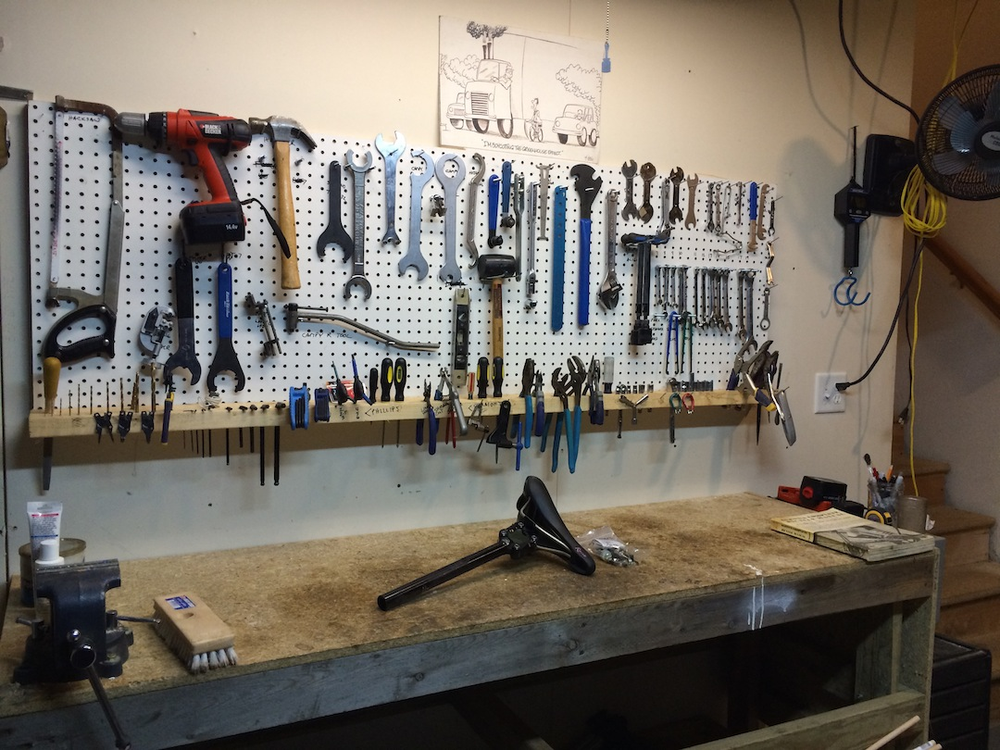

# Objectives

- Introduce the git and IntelliJ workflow
- Work through last week's homework together
- Resubmit our homework using our new git and IntelliJ workflow
- Talk our about our problem solving toolkit
- Intro the homework for this week

# Tools 

## Software writing / debugging tools
- IntelliJ
- git / GitHub
- Java, JavaScript, HTML
- Web APIs

## The tools that our language gives us
- if / else
- loops
- arrays
- switch
- classes
- enums

## Problem solving toolkit

- Understand the problem
- Break the problem down in smaller pieces
- Know what your inputs are and what you expect to output
- Write it down (in english or another spoken language!)
- Start with what you know
- Identify a first step 
- Make a diagram or draw it out
- Start with a simple test case
- Good code style and formatting!
- See a working example 
- Think about similar problems you've seen before
- Check your output
- Read the error message
- Run your code often
- Be organized!
- Take a breather
